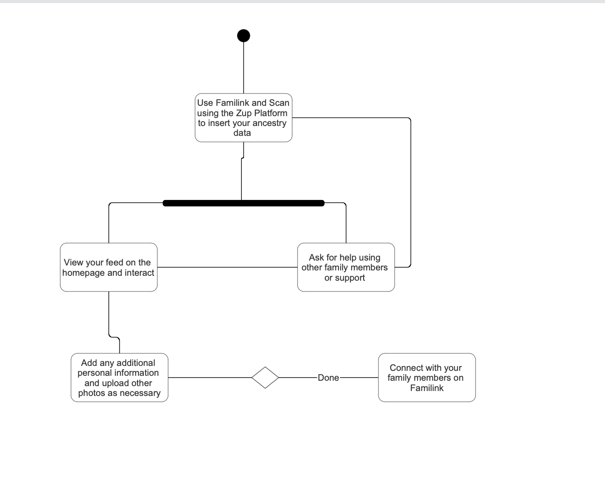
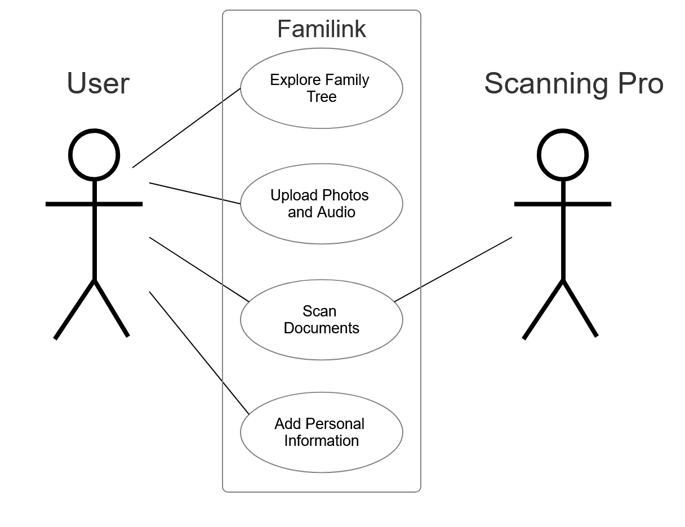

# Familink UMass Boston Student Code Repository
CS 410 Group 3 Project for Familink
Group members: Jonathan Pimentel, Felix Daily, Kalyan Ram Mamidipaka, Raymond Dugas, Rock Pulak 

Familink is a multimodal app designed to build family trees and connect people to their roots, extract relevant information from records and generate family narrative by capturing family stories in all forms, such as text, images and audio.
Our goal is to have an engaging user platform that allows the user to digitize their family genealogy by scanning their Zupus.

# Zupu Exammple 
(assets/Gallery/00001.jpg)

# Tech Stack 
In React-native, Metro is the javascript bundler for the app. Instead of using Xcode or emulators,  we used Expo instead having the development build running on our mobile devices.
We primarily focused on the frontend aspect of the app,  Expo Go is the mobile app used to do so 
We opted to do manual testing, debugging and Expo would compile and run in real-time and send render/syntax/and logical errors immediately

# React Native
Fullstack development for all mobile app development using transpiling to automatically convert the code to native ios/android functionality

# Expo
Use development build instead of emulator build on Xcode

# appwrite
backend server  controlling the users and what files can be uploaded.

# Required Installations for the project 
download Node.Js: https://nodejs.org/en

Setup Project files
npm create-expo-app ./    

Install dependencies 
npx expo install expo-router react-native-safe-area-context react-native-screens expo-linking expo-constants expo-status-bar

if necessary:
npx expo install --fix to update deprecated or older dependencies 

Setup Entry point in package.json file 
override "main" : "node_modules/expo/AppEntry.js" with "main": "expo-router/entry"

Create a folder named App, using the same "starter code" as App.js then delete the original App.js file 

In the App folder paste, the default App.js code in a new file named "_layout.jsx" file 

Modify project configuration by adding a deep linking scheme in app config (app.json file):
{
    "scheme": "Familink"
}

EXPO app needed for (ios build):
npx expo install expo-dev-client

Helpful extension for Expo development 
ES7+ Extension by dsznajder

Use Version 2 of NativeWind (Using Tailwind CSS)
npm install nativewind
npm install --save-dev tailwindcss@3.3.2
npx tailwindcss init 

Run the app:
npx expo start 
npx expo start -c is for without caching 

# Installing Appwrite
appwrite is free, open-source application that allows users to customize their backend and functions on their web and mobile apps
Quick Start guide: https://appwrite.io/docs/quick-starts/react-native

# Install Command 
npx expo install react-native-appwrite react-native-url-polyfill
Adding Logic using appwrite to add Databases, Storage, Functions 

# Images files

# Files 
app folder contains two folders (auth) and (tabs) containing files for the login pages and tabs respectively.
assets contains all images, fonts, icons and other assets used in the app. 
constants imports all those assets to have them available in the app.
components is a separate folder where components like our buttons, search bar, etc are stored.
lib folder contains all backend logic and functions from appwrite. 

# Sources 
Documentation guide:
https://guides.lib.berkeley.edu/how-to-write-good-documentation

Expo Documents:
https://docs.expo.dev/

